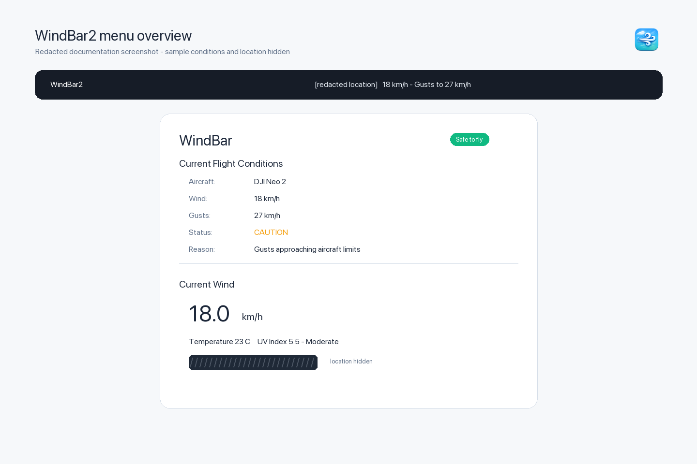
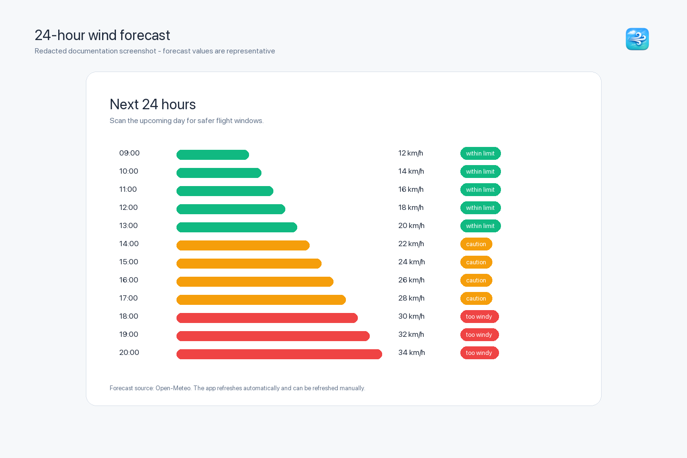
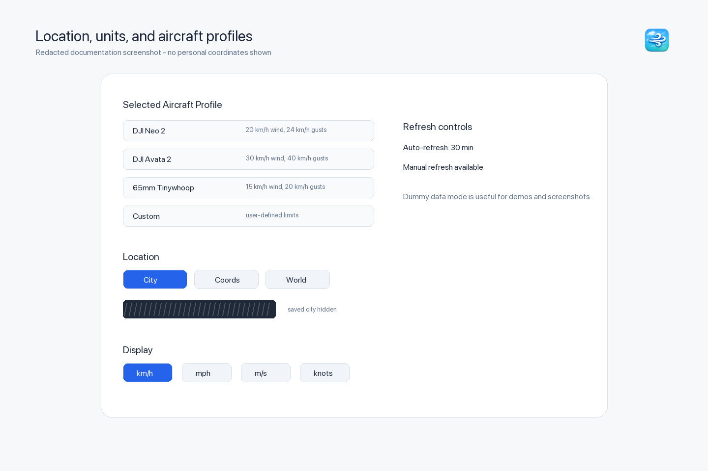
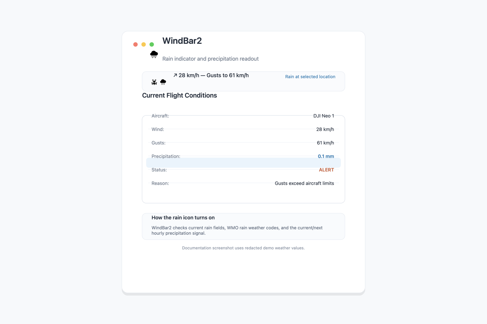

# WindBar2

WindBar2 is a lightweight macOS menu bar app for checking wind conditions before flying drones, FPV quads, or any activity where wind speed matters. It shows current wind, gusts, temperature, UV index, and a 24-hour wind forecast, then compares the conditions against aircraft-specific safety profiles.



## Highlights

- Menu bar wind readout with direction, sustained wind, and gusts.
- Rain-aware menu bar icon when current conditions report rain, showers, or precipitation.
- Current flight condition status for common drone profiles.
- Aircraft presets for DJI Neo 1, DJI Neo 2, BetaFPV Pavo 20 Pro, DJI Avata 2, 65mm Tinywhoop, and custom limits.
- 24-hour wind forecast for spotting safer flight windows.
- Location modes for city name, coordinates, or world city selection.
- Wind units: km/h, mph, m/s, and knots.
- Temperature units: C and F.
- Adjustable auto-refresh interval and manual refresh.
- Dummy data mode for demos, testing, and documentation screenshots.
- Menu-bar-only design with no Dock clutter.

## Screenshots

| Overview | Forecast |
| --- | --- |
|  |  |

| Settings | Rain Indicator |
| --- | --- |
|  |  |

Screenshots are redacted documentation images. Personal location text and exact coordinates are hidden.

## Requirements

- macOS with SwiftUI support.
- Xcode for building from source.
- Internet access for live weather data from Open-Meteo.

## Build From Source

Open the project in Xcode:

```bash
open WindBar2/WindBar2.xcodeproj
```

Or build from Terminal:

```bash
DEVELOPER_DIR=/Applications/Xcode.app/Contents/Developer \
xcodebuild -project WindBar2/WindBar2.xcodeproj \
  -scheme WindBar2 \
  -configuration Release \
  build
```

The release app will be created in Xcode's build products directory. For local development on this machine, a known-good explicit derived data build command is:

```bash
DEVELOPER_DIR=/Applications/Xcode.app/Contents/Developer \
xcodebuild -project WindBar2/WindBar2.xcodeproj \
  -scheme WindBar2 \
  -configuration Release \
  -derivedDataPath /tmp/WindBar2Build \
  build
```

## Basic Use

1. Launch WindBar2.
2. Click the WindBar2 item in the macOS menu bar.
3. Choose a location mode:
   - `City`: type a city name.
   - `Coords`: enter latitude and longitude.
   - `World`: choose from the built-in region, country, and city lists.
4. Select wind and temperature units.
5. Choose an aircraft profile or enter custom wind and gust limits.
6. Review the current flight status and the next 24 hours of wind.

See [docs/USER_GUIDE.md](docs/USER_GUIDE.md) for detailed instructions.

## Weather Data

WindBar2 uses the Open-Meteo forecast API for live weather. It requests current conditions and the next 24 hours of hourly forecast data for the selected location, including wind, temperature, UV, pressure, precipitation, rain, showers, precipitation probability, and WMO weather codes.

The app stores user preferences locally with `UserDefaults`, including the selected location mode, last city, coordinates, selected world city, and aircraft profile settings.

See [docs/PRIVACY.md](docs/PRIVACY.md) for privacy details.

## Safety Notice

WindBar2 is an advisory tool. It is not a substitute for pilot judgment, local regulations, official aviation weather sources, or on-site condition checks. Always follow the laws and safety requirements that apply where you fly.

## Hire / Contact

FPV-dB is available for macOS, SwiftUI, RF tooling, drone software, mapping, and field-operations utilities. Use the GitHub repository owner profile for work enquiries.

## License

See [LICENSE](LICENSE).
