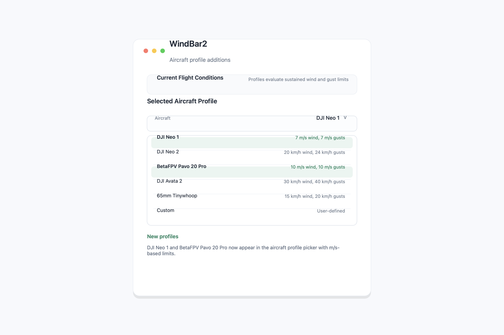

# WindBar2 User Guide

WindBar2 lives in the macOS menu bar. It is designed for quick wind checks before a flight, with enough detail to decide whether conditions are comfortable, marginal, or outside the selected aircraft limits.

## Launching WindBar2

1. Open `WindBar2.app`.
2. Look for the WindBar2 item in the macOS menu bar.
3. Click the menu bar item to open the popover.
4. Click the close button in the popover to quit the app.

WindBar2 is menu-bar-only, so it does not keep a normal Dock window open.

## Reading The Menu Bar

The menu bar shows the latest wind speed and, when available, gust information. The icon changes with the selected aircraft profile and current wind condition:

- `GOOD`: wind and gusts are comfortably within limits.
- `CAUTION`: wind or gusts are approaching the selected limits.
- `WARNING`: wind or gusts are close to the selected limits.
- `ALERT`: wind or gusts exceed the selected limits.

If the app is still loading, the menu bar may show a waiting state until weather data is available.

## Current Flight Conditions

The top of the popover summarizes the selected aircraft profile, current wind, gusts, condition, and reason. The reason explains whether sustained wind or gusts are driving the status.

Use this section as a fast pre-flight scan:

- Check the aircraft profile first.
- Compare sustained wind and gusts.
- Treat gust-driven warnings seriously, especially for small aircraft.

## Aircraft Profiles

WindBar2 includes these built-in profiles:

| Profile | Sustained wind limit | Gust limit |
| --- | ---: | ---: |
| DJI Neo 1 | 7 m/s | 7 m/s |
| DJI Neo 2 | 20 km/h | 24 km/h |
| BetaFPV Pavo 20 Pro | 10 m/s | 10 m/s |
| DJI Avata 2 | 30 km/h | 40 km/h |
| 65mm Tinywhoop | 15 km/h | 20 km/h |
| Custom | User-defined | User-defined |

To use custom limits:

1. Choose `Custom` from the aircraft picker.
2. Enter an aircraft name.
3. Enter maximum sustained wind and maximum gust values in km/h.

## Location Modes

WindBar2 supports three ways to choose weather location:

### City

Enter a city name. The app geocodes the city and fetches weather for that location.

### Coords

Enter latitude and longitude manually. This is useful for a specific flying field or rural location.

### World

Choose a region, country, and city from the built-in city list.

## Display Options

WindBar2 can display wind in:

- km/h
- mph
- m/s
- knots

Temperature can be shown in C or F. The popover width can be set to compact, regular, or wide.

## Refreshing Data

WindBar2 refreshes automatically using the selected interval. The default interval is 30 minutes. You can also click `Refresh now` to fetch current data immediately.

Use shorter refresh intervals when conditions are changing quickly. Use longer intervals when you only need an occasional menu bar check.

## 24-Hour Forecast

The `Next 24 hours` section shows upcoming hourly wind values. When alerts are enabled, WindBar2 marks hours that are within the selected wind limit. This helps identify better flight windows later in the day.

## Drone Safety Alerts

Enable wind alerts to compare current wind against the maximum safe wind value. The alert status updates when weather data changes or when the threshold is adjusted.

The aircraft profile status and the wind alert threshold are related but separate:

- Aircraft profiles evaluate both wind and gusts.
- The wind alert slider evaluates the current sustained wind threshold.

## Dummy Data Mode

`Use dummy data` fills the app with sample values. This is useful for demos, screenshots, and UI checks when you do not want to request live weather.

## Troubleshooting

### Weather does not load

- Confirm the Mac has internet access.
- Try a simpler city name.
- Use coordinates for precise locations.
- Click `Refresh now`.

### Coordinates are not accepted

- Latitude must be between -90 and 90.
- Longitude must be between -180 and 180.
- Use decimal degrees, for example `-34.9285` and `138.6007`.

### The menu bar item is missing

- Relaunch the app.
- Check that the app is not hidden behind a crowded menu bar.
- Quit older copies of WindBar2 before launching a new build.

## Safety Reminder

WindBar2 is an advisory tool. Always check the flying area, local rules, official weather, obstacles, people, and aircraft restrictions before taking off.
